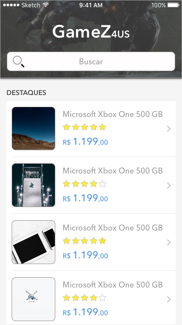
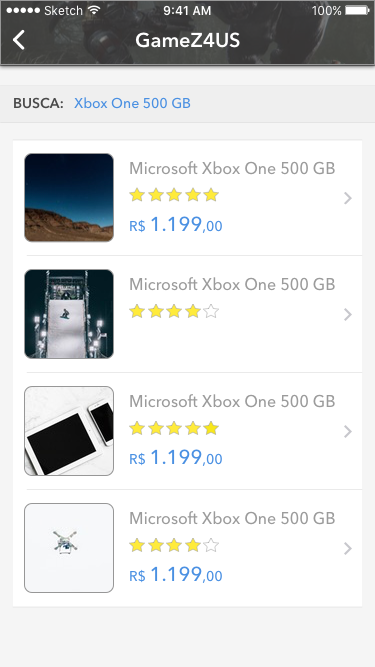

# game4us-react-native

Aplicação de referência de uso do React Native para construção de uma aplicação simples que faz busca de Games e Consoles nos sites Buscapé e Mercado Livre. Este código foi criado para gerar a aplicação iOS e Android com código nativo.

## Resumo

Baixando este exemplo você vai encontrar o uso de:
 - View
 - Text
 - Image
 - ScrollView
 - TextInput
 - Keyboard
 - WebView
 - Linking
 - Component
 - TouchableOpacity
 - TouchableWithoutFeedback
 - KeyboardAvoidingView

Além disso, tem também:
 - Actions (react-native-router-flux)
 - Router
 - Scene
 - axios (axios)

## Screenshots

## Construído utilizando

* [React Native](https://facebook.github.io/react-native) - React Native.
* [React Native Router](https://github.com/aksonov/react-native-router-flux) - React Native Navigation API Framework.
* [Axios](https://www.npmjs.com/package/axios) - Componente para parse de requisições HTTP.

## Autor

* **João Carlos Brandão Morgado** - *Trabalho Inicial* - [joaobrandao](https://github.com/jocabrandao)

## Licença

MIT 